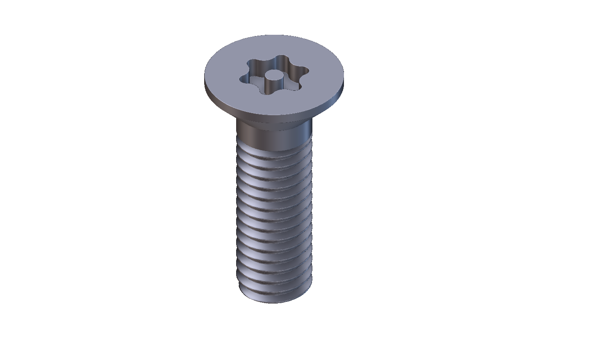

# Parametric Torx screw

**Built with Claude Opus 5 [Extra].**

One configured Torx call returns N detailed screws and N filled cutting moulds, in insertion-point order, for any mix of series, sizes and drives. Placement is list-driven: a batch of insertion points, axes, tangent references and clocking angles, with optional tangent-plane flush against a reference body. The package ships the compact V2 assembly, its two list extractors, a ready-to-open wired example, and the example's implicit input.

## Start here

1. Download the package folder and keep every file together, including `nT-0008-Ex.implicit`.
2. Open [Torx_Example.ntop](Torx_Example.ntop). It already connects one configured Torx call to both extractors and to native Boolean Subtract blocks.
3. If nTop asks for the implicit input, select the supplied `nT-0008-Ex.implicit` beside the notebook.
4. Configure **Torx** once, then read the two lists through **Torx Screws** and **Torx Outer Moulds**. Do not wire the paired container straight into a Boolean block.
5. To use the screw in an existing notebook, import [Torx.ntop](Torx.ntop) and replace the old call, reconnecting its inputs and outputs.

Recorded native build: **nTop 6.1.0-rc commit-050d0c7cdc8e412c3a35298bc5a89dc8a6da864d**, referred to as build 42926. The catalogue version field cannot encode a release-candidate build, so `ntopVersion` reads `6.1`. Compatibility with a public nTop release has not been re-tested.

The compact assembly carries a **new custom-block UUID**. It is not an in-place update of the frozen V2 definition: importing it and reconnecting is the supported path, and the supplied example already references the compact version.

In `Torx_Example.ntop` the `Diff_` block reads `e_DIRTY` on open. That is deliberate: its driving multi-region mesh from implicit is set to manual run mode so the file opens cheaply. Run it when you want the result.

## The interface

`Torx.ntop` exposes eighteen inputs.

| Input | Type | Notes |
|---|---|---|
| Drive family | choice | Internal Torx, or the tamper-resistant derivative with a sourced post. |
| Screw series | choice | Cylindrical ISO 14579:2011, Pan ISO 14583:2011, Countersunk ISO 14581:2013. |
| Metric size | choice | Series and size combinations from the source tables. |
| Drive size | choice | Automatic, or an explicit T size. |
| Length | list<real> | One value for the batch, or one per insertion point. |
| Override shank, Shank radius | bool, list<real> | A custom radius no longer carries a standard metric thread designation. |
| Override Torx, Torx radius | bool, list<real> | Independent of the shank scaling. |
| Insertion Point | list<point> | The batch. Every list input broadcasts against it. |
| Axis | list<vector> | No fallback for a zero axis; it is refused rather than guessed. |
| Tangent Reference | list<vector> | Must not be parallel to the axis. |
| Clocking Angle | list<real> | |
| Placement mode | choice | Surface placement takes the tangent-plane normal at the original point; explicit placement uses the untilted axis. |
| **Reference Body** | **implicit** | The host the screws are placed against. This is what `nT-0008-Ex.implicit` feeds in the example. |
| Tilt X, Tilt Y | list<real> | Applied before flush; flush follows the final tilted axis. |
| Flush | list<bool> | One flag for the batch or one per point. Default false preserves V1 placement. |

The output is a paired container: N detailed bodies followed by N moulds. nTop exposes one notebook output and the measured compiler refused the list-valued aggregate forms, which is why the two extractors exist rather than a second output.

## Flush

With **Flush** true the screw moves inward along its final tilted axis until the highest point of its outer head envelope touches the tangent plane at the original insertion point. Tilt and clocking are unchanged, and both the real screw and its mould receive the same translation. Cylindrical heads use their circular top-edge round, pan heads their spherical crown including the transition to the outer edge, and countersunk heads their flat top rim, whose untilted datum is already flush so the shift is zero until tilted.

This is tangent-plane flush. A curved host can locally rise above or fall below that plane, so the option does not guarantee full burial beneath the actual curved surface. Input points are not projected or snapped, screw length is unchanged, and enabling flush moves the tip deeper into the host.

## Files

- [Torx.ntop](Torx.ntop): the compact V2 assembly, complete screw and filled outer-mould geometry.
- [Torx_Screws.ntop](Torx_Screws.ntop): detailed screw list extractor.
- [Torx_Outer_Moulds.ntop](Torx_Outer_Moulds.ntop): outer mould list extractor.
- [Torx_Example.ntop](Torx_Example.ntop): the wired example, with the two extractors and Boolean consumers.
- [nT-0008-Ex.implicit](nT-0008-Ex.implicit): the reference body the example reads.

## What is verified

Recorded in the source project, on the assembly this package ships:

| Check | Result |
|---|---|
| Mould | 54 native field and Boolean checks across all three series and both drive families. |
| Flush | 25 cases agree with a separately sampled 20,001-station head profile within 4.62e-13 m. Perpendicular and backward active directions reject. |
| Extractors | Six pairing and two Boolean checks; four empty and odd-list guards reject. |
| Full-wrapper integration | 96 field checks and 12 plane-placement checks across 12 screws, all three series, mixed flush flags. Largest contact residual at about 5.3 m world coordinates was 0.063 micrometre. |
| Size and speed | 1,367,456 bytes against the frozen V2's 2,796,456, a 51.1% reduction. Median conversion 8.7 s against 50.0 s; median default execution 4.7 s against 7.5 s. |

These are construction checks, not manufacturing tolerances. The moulds carry no fit clearance: they are exact declared CAD forms, not a tapped-hole specification. Inherited source-contour and thread-detail limitations still apply, and no manufacturing-conformity claim is made.

## License and credits

MIT. See [LICENSE](LICENSE). The standards themselves are not redistributed.
