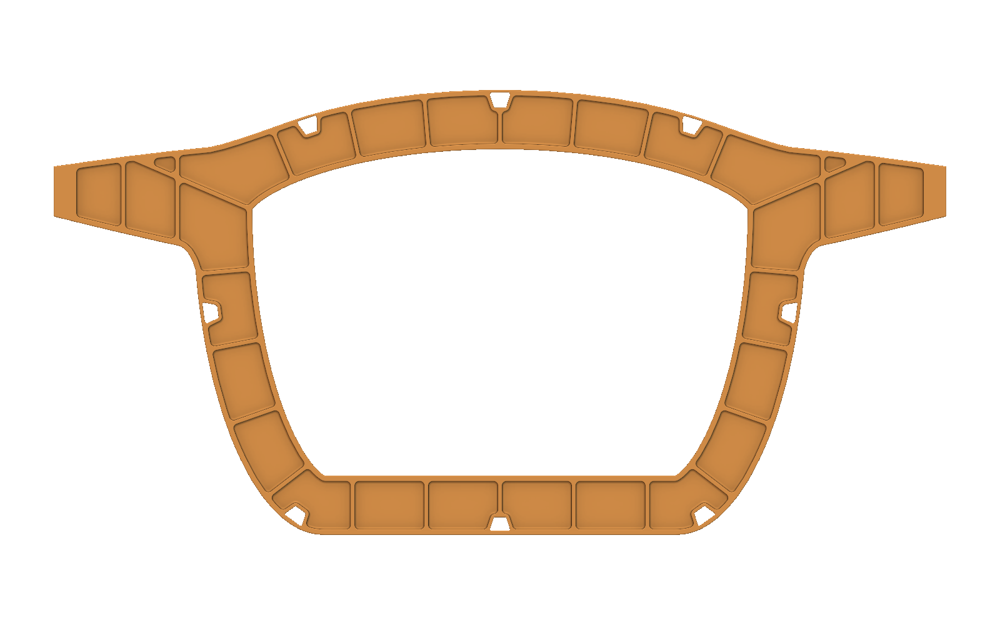

# Aircraft bulkheads E: conformal pockets and hat passages

Explore twelve native station parts with conformal pockets, floor blends, and revised passages for hat longerons.

Revision E includes the forward primary at FS 4000 mm, aft primary at FS 5400 mm, and ten adjacent frames. Each primary has 28 conformal pockets on each face and R6.35 floor blends. Separate station notebooks retain editable inputs and implicit outputs. Earlier Revision D buckling results do not qualify Revision E. The full aircraft assembly and source reference geometry are outside this station-part package.

## Installation and use

1. Download the package files and keep them together.
2. Open `forward-primary-bulkhead.ntop` in the matching licensed nTop build.
3. Save a working copy before editing. Expand the relevant section and change one control at a time.
4. Inspect the rebuilt bodies and block states before accepting the changed model.

Recorded native build: **6.1.0-rc 42926**. The catalogue version field cannot encode the custom build number. Public release compatibility has not been re-tested. The application and license are not included.

## Inputs and outputs

| Direction | Contents |
|---|---|
| Input | Promoted axial thickness and local pocket controls |
| Output | Twelve independent native implicit station parts |

Named scalar controls include `Axial thickness`, `Residual web`, `Perimeter edge break`, `Low X face`, `Plan corner radius`, `Rolling ball radius`. Some are computed values; inspect their upstream construction before changing them.

## Files

- [aft-primary-bulkhead.ntop](aft-primary-bulkhead.ntop)
- [f01-frame.ntop](f01-frame.ntop)
- [f02-frame.ntop](f02-frame.ntop)
- [f03-frame.ntop](f03-frame.ntop)
- [f04-frame.ntop](f04-frame.ntop)
- [f05-frame.ntop](f05-frame.ntop)
- [f07-frame.ntop](f07-frame.ntop)
- [f09-frame.ntop](f09-frame.ntop)
- [f10-frame.ntop](f10-frame.ntop)
- [f11-frame.ntop](f11-frame.ntop)
- [f12-frame.ntop](f12-frame.ntop)
- [forward-primary-bulkhead.ntop](forward-primary-bulkhead.ntop)

## Evidence and source

Publication checks are offline: native-container round trips, export-path changes, collapsed presentation, dependency inspection, and binary payload preservation. These checks do not constitute new native execution. See [publication-checks.json](publication-checks.json).

## License

MIT. See [LICENSE](LICENSE). This license covers the original example models, saved recipes, and supporting material in this package.
