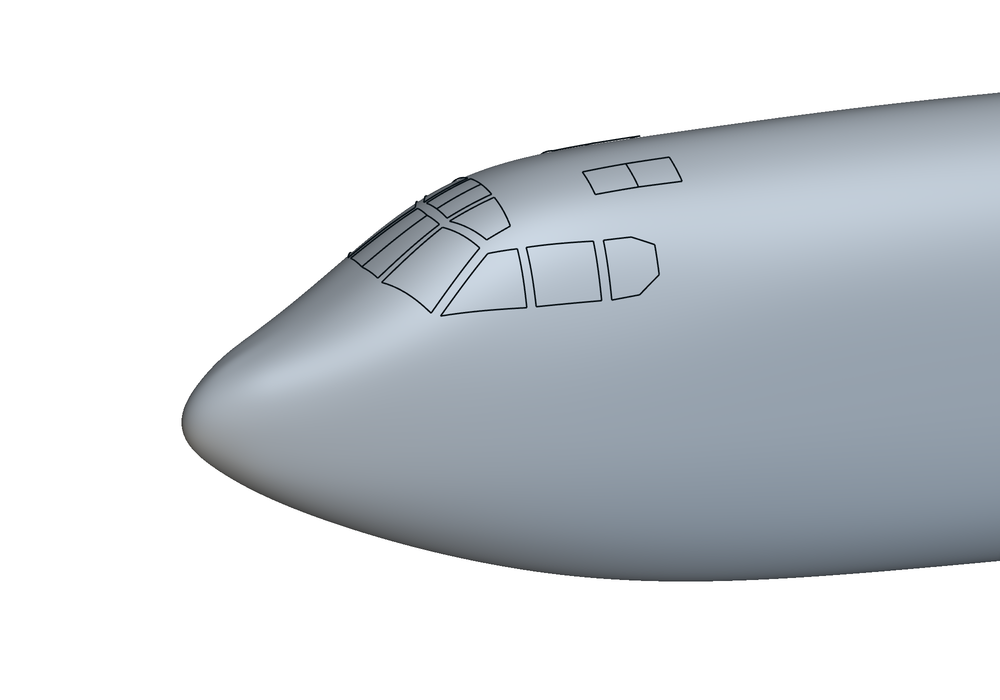

# B52 fuselage R7: fair nose and cockpit loft

**Built with Astra.**

Study an editable native fuselage with a fair nose blend and accepted cockpit loft, derived from the GPL-2.0 B-52F artist model.

R7 refines the underside nose transition and preserves the accepted cockpit. Reference agreement concerns an artist model, not production aircraft geometry. Source credit: Lee Elliott and Nguyen Tri Toan Phuc, FGMEMBERS/B-52F.

## Installation and use

1. Download the package files and keep them together.
2. Open `b52-fuselage-r7.ntop` in the matching licensed nTop build.
3. Save a working copy before editing. Expand the relevant section and change one control at a time.
4. Inspect the rebuilt bodies and block states before accepting the changed model.

Recorded native build: **6.0.0-rc 42594**. The catalogue version field cannot encode the custom build number. Public release compatibility has not been re-tested. The application and license are not included.

## Inputs and outputs

| Direction | Contents |
|---|---|
| Input | Fitted guide curves and conic shape controls |
| Output | Native fuselage and cockpit surfaces |

Named scalar controls include `Fuselage length`. Some are computed values; inspect their upstream construction before changing them.

## Files

- [b52-fuselage-r7.ntop](b52-fuselage-r7.ntop)

## Evidence and source

Publication checks are offline: native-container round trips, export-path changes, collapsed presentation, dependency inspection, and binary payload preservation. These checks do not constitute new native execution. See [publication-checks.json](publication-checks.json).

The [source, usage notes, and recorded report](https://github.com/bradrothenberg/ntop-api-share/tree/92f13bc0a873aacba62526ee43e9e6895ef051f8/demos/b52) retain the original construction and verification scope. Download the public source checkout to view reports with their local assets.

## License and attribution

GPL-2.0. See [LICENSE](LICENSE). Derived from the [FGMEMBERS/B-52F artist model](https://github.com/FGMEMBERS/B-52F), by Lee Elliott and Nguyen Tri Toan Phuc. The complete corresponding source, fitted controls, upstream artist file, and numerical evaluator are in the linked source folder.
