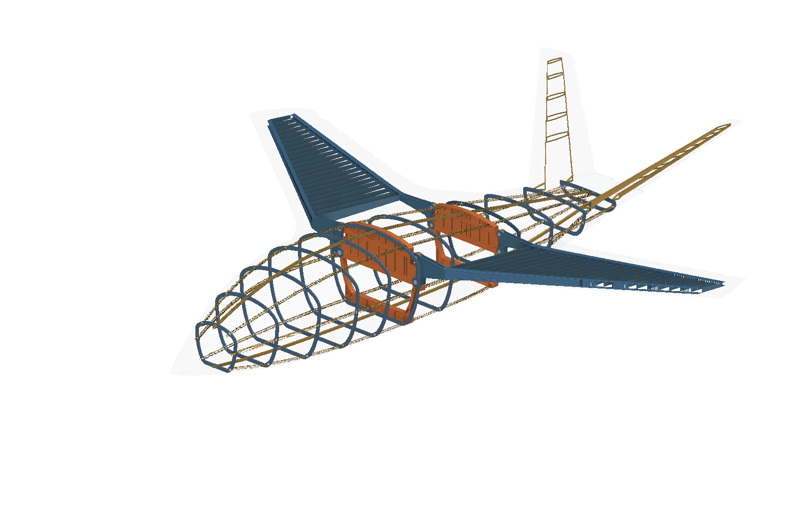

# Civil research aircraft: Revision G and design studies

**Built with Astra.**

An editable civilian research-aircraft structure with Revision G as the primary delivery. The bundle contains 74 native notebooks and eight engineering reports. It includes the complete saved assemblies, separate station parts, hat longerons, forked spars, cover splices, and nominal pin hardware.

## Start here

1. Download the complete package folder. Keep `reports/assets/`, `references/`, and `evidence/` with the notebooks.
2. Open [the report catalogue](reports/index.html), then read [the Revision G review](reports/revision-g-lug-attachments.html).
3. Open [civil-research-aircraft-rev-g.ntop](civil-research-aircraft-rev-g.ntop) in licensed nTop **6.1.0-rc build 42926**. Save a working copy before editing.
4. Expand the relevant structural section to inspect or edit a part. Use the separate joint and frame notebooks for alternate presentations.
5. Rebuild and verify both mating parts after a joint change. Save a separate assembly revision and check its embedded part definitions.

The minimum-version field cannot specify this custom build. Compatibility with a public nTop release has not been re-tested. The application is not included.

The saved aircraft reference includes two airfoil file inputs. Their workstation paths now point to the supplied `references/` files. If nTop requests a file after relocation, select the matching local DAT file. The matching CSV tables are also supplied. The earlier source helper can generate the CSV beside its DAT input; keep a writable working copy. Opening these public copies has not been re-tested in nTop.

## Revision G

The assembly uses upper and lower integral bulkhead eyes, forked spar roots, eight nominal pins, and a separate cover-splice load path. The 14 changed structural part notebooks and the pin family are included. Assembly, forward-joint, aft-joint, and frame-only presentations preserve their saved visibility states.

The recorded source checks report 1,997 geometry probes passed, 174 embedded assembly definitions, and 128 GUI variables with `e_OK` states. These establish the stated geometry and graph checks. They do not establish structural capacity. The local fork stress screens fail, and the complete Revision G aircraft analysis remains open. No new Revision G STEP is claimed.

## Inputs and outputs

| Item | Editable data | Result and limit |
|---|---|---|
| Revision G assembly | Embedded part definitions, placements, and visibility groups | Complete saved structural assembly with the aircraft reference |
| Revision G primaries and spars | Native variables within each complete part expression | Finished bulkhead eyes and matching forked roots; joint interfaces are nominal |
| Pin family | Pin diameter input | Nominal pin body; changing it alone does not resize mating bores |
| Earlier D/E/F assemblies | Frame thickness, primary thickness, and residual-web controls | Earlier geometry revisions with their own recorded checks |
| Section studies | I, flat, and hat section dimensions | Native section coupons for the earlier buckling comparison |

Parts already use aircraft world coordinates. Do not apply a second placement. Imported custom blocks are embedded snapshots. Saving a standalone part does not update its assembly. A changed interface requires coordinated edits and an explicit assembly refresh.

## Reports

- [Revision G: local lug attachments](reports/revision-g-lug-attachments.html): Primary review. Integral bulkhead eyes, forked spar roots, nominal pins, native checks, and failed local fork stress screens.
- [Revision F: pad-to-flange ribs](reports/revision-f-design.html): Earlier installed structure with pad support ties, native geometry checks, and independent STEP mass results.
- [Revision E: hat longerons](reports/revision-e-design.html): Earlier hat longerons, conformal station parts, and revised primary passages.
- [Revision D: modular fitted structure](reports/revision-d-design.html): Earlier modular assembly, pocket corrections, part input contracts, and fit checks.
- [Edge-aligned comparison: sizing audit](reports/edge-aligned-sizing-audit.html): Measured spar directions, corrected coupling-mass accounting, and unresolved sizing assumptions.
- [Wing-root trade](reports/wing-root-trade.html): Recorded layout, station, gauge, mass, and sensitivity comparisons. Failed primary stress screens remain visible.
- [Cranked-wing review](reports/cranked-wing-review.html): Earlier spar route comparisons and their local load-path implications.
- [Buckling and thin sections](reports/buckling-review.html): Earlier assumed-load study with editable I, flat, and hat section coupons.

## Native model catalogue

The filenames identify each revision. Candidate C and the edge-aligned model are separate comparison assemblies. Earlier D/E/F assemblies remain separate from Revision G.

### Revision G assembly

- [civil-research-aircraft-rev-g.ntop](civil-research-aircraft-rev-g.ntop)

### Revision G parts and presentations

- [rev-g-aft-lug-joint.ntop](rev-g-aft-lug-joint.ntop)
- [rev-g-c-aft.ntop](rev-g-c-aft.ntop)
- [rev-g-c-fwd.ntop](rev-g-c-fwd.ntop)
- [rev-g-forward-lug-joint.ntop](rev-g-forward-lug-joint.ntop)
- [rev-g-frames-g.ntop](rev-g-frames-g.ntop)
- [rev-g-p-front-spar.ntop](rev-g-p-front-spar.ntop)
- [rev-g-p-lower-inner-splice.ntop](rev-g-p-lower-inner-splice.ntop)
- [rev-g-p-lower-outer-splice.ntop](rev-g-p-lower-outer-splice.ntop)
- [rev-g-p-rear-spar.ntop](rev-g-p-rear-spar.ntop)
- [rev-g-p-upper-inner-splice.ntop](rev-g-p-upper-inner-splice.ntop)
- [rev-g-p-upper-outer-splice.ntop](rev-g-p-upper-outer-splice.ntop)
- [rev-g-s-front-spar.ntop](rev-g-s-front-spar.ntop)
- [rev-g-s-lower-inner-splice.ntop](rev-g-s-lower-inner-splice.ntop)
- [rev-g-s-lower-outer-splice.ntop](rev-g-s-lower-outer-splice.ntop)
- [rev-g-s-rear-spar.ntop](rev-g-s-rear-spar.ntop)
- [rev-g-s-upper-inner-splice.ntop](rev-g-s-upper-inner-splice.ntop)
- [rev-g-s-upper-outer-splice.ntop](rev-g-s-upper-outer-splice.ntop)
- [rev-g-root-pin.ntop](rev-g-root-pin.ntop)

### Revision F

- [rev-f-aircraft-structure.ntop](rev-f-aircraft-structure.ntop)
- [rev-f-forward-primary-bulkhead.ntop](rev-f-forward-primary-bulkhead.ntop)
- [rev-f-aft-primary-bulkhead.ntop](rev-f-aft-primary-bulkhead.ntop)
- [rev-f-f01-frame.ntop](rev-f-f01-frame.ntop)
- [rev-f-f02-frame.ntop](rev-f-f02-frame.ntop)
- [rev-f-f03-frame.ntop](rev-f-f03-frame.ntop)
- [rev-f-f04-frame.ntop](rev-f-f04-frame.ntop)
- [rev-f-f05-frame.ntop](rev-f-f05-frame.ntop)
- [rev-f-f07-frame.ntop](rev-f-f07-frame.ntop)
- [rev-f-f09-frame.ntop](rev-f-f09-frame.ntop)
- [rev-f-f10-frame.ntop](rev-f-f10-frame.ntop)
- [rev-f-f11-frame.ntop](rev-f-f11-frame.ntop)
- [rev-f-f12-frame.ntop](rev-f-f12-frame.ntop)

### Revision E

- [rev-e-aircraft-structure.ntop](rev-e-aircraft-structure.ntop)
- [rev-e-forward-primary-bulkhead.ntop](rev-e-forward-primary-bulkhead.ntop)
- [rev-e-aft-primary-bulkhead.ntop](rev-e-aft-primary-bulkhead.ntop)
- [rev-e-f01-frame.ntop](rev-e-f01-frame.ntop)
- [rev-e-f02-frame.ntop](rev-e-f02-frame.ntop)
- [rev-e-f03-frame.ntop](rev-e-f03-frame.ntop)
- [rev-e-f04-frame.ntop](rev-e-f04-frame.ntop)
- [rev-e-f05-frame.ntop](rev-e-f05-frame.ntop)
- [rev-e-f07-frame.ntop](rev-e-f07-frame.ntop)
- [rev-e-f09-frame.ntop](rev-e-f09-frame.ntop)
- [rev-e-f10-frame.ntop](rev-e-f10-frame.ntop)
- [rev-e-f11-frame.ntop](rev-e-f11-frame.ntop)
- [rev-e-f12-frame.ntop](rev-e-f12-frame.ntop)

### Revision D

- [rev-d-aircraft-structure.ntop](rev-d-aircraft-structure.ntop)
- [rev-d-forward-primary-bulkhead.ntop](rev-d-forward-primary-bulkhead.ntop)
- [rev-d-aft-primary-bulkhead.ntop](rev-d-aft-primary-bulkhead.ntop)
- [rev-d-f01-frame.ntop](rev-d-f01-frame.ntop)
- [rev-d-f02-frame.ntop](rev-d-f02-frame.ntop)
- [rev-d-f03-frame.ntop](rev-d-f03-frame.ntop)
- [rev-d-f04-frame.ntop](rev-d-f04-frame.ntop)
- [rev-d-f05-frame.ntop](rev-d-f05-frame.ntop)
- [rev-d-f07-frame.ntop](rev-d-f07-frame.ntop)
- [rev-d-f09-frame.ntop](rev-d-f09-frame.ntop)
- [rev-d-f10-frame.ntop](rev-d-f10-frame.ntop)
- [rev-d-f11-frame.ntop](rev-d-f11-frame.ntop)
- [rev-d-f12-frame.ntop](rev-d-f12-frame.ntop)

### Edge-aligned comparison

- [edge-aligned-aircraft-c.ntop](edge-aligned-aircraft-c.ntop)
- [edge-aligned-c-fwd.ntop](edge-aligned-c-fwd.ntop)
- [edge-aligned-c-aft.ntop](edge-aligned-c-aft.ntop)

### Candidate C comparison

- [candidate-c-aircraft-c.ntop](candidate-c-aircraft-c.ntop)

### Hat longerons

- [hat-longerons-l01-longeron-path.ntop](hat-longerons-l01-longeron-path.ntop)
- [hat-longerons-l02-longeron-path.ntop](hat-longerons-l02-longeron-path.ntop)
- [hat-longerons-l03-longeron-path.ntop](hat-longerons-l03-longeron-path.ntop)
- [hat-longerons-l04-longeron-path.ntop](hat-longerons-l04-longeron-path.ntop)
- [hat-longerons-l05-longeron-path.ntop](hat-longerons-l05-longeron-path.ntop)
- [hat-longerons-l06-longeron-path.ntop](hat-longerons-l06-longeron-path.ntop)
- [hat-longerons-l07-longeron-path.ntop](hat-longerons-l07-longeron-path.ntop)
- [hat-longerons-l08-longeron-path.ntop](hat-longerons-l08-longeron-path.ntop)

### Buckling section studies

- [buckling-thin-sections-study.ntop](buckling-thin-sections-study.ntop)
- [buckling-i-section-generator.ntop](buckling-i-section-generator.ntop)
- [buckling-flat-section-generator.ntop](buckling-flat-section-generator.ntop)
- [buckling-hat-section-generator.ntop](buckling-hat-section-generator.ntop)

## Scope of this package

This is a native-model and report handoff. It includes recorded numerical summaries and source workflow notes. It does not include the original execution harness, rebuild scripts, STEP exports, raw meshes, solver work directories, or reference photographs and sketches. Report links to omitted scripts or STEP files lead here. The original reports identify those operations and their original revision scope.

The HTML reports use the adjacent asset folder and work offline. They retain the recorded calculations, native views, engineering limits, and failed studies. Source reference images and screenshots containing workstation paths are omitted. Native family colors are retained; report highlights use nTop blue.

## Publication checks

See [publication-checks.json](publication-checks.json) for source and published hashes, exact native function preservation, portable airfoil paths, and report-image provenance. The final [source validation record](evidence/rev-g-final-validation.json) describes the original native run. Its hashes refer to the source files before publication changes. Other evidence files also retain their original revision and sample scope.

New checks are offline packaging checks. No new native execution, geometry certification, load validation, or weight optimization is claimed. Earlier structural failures remain part of the review.

## License and credits

MIT for Brad Rothenberg's original model and report work. See [LICENSE](LICENSE). Built with Astra.

The aircraft source retains its embedded custom-block attribution, including the bounded triangular-prism method credited to [Inigo Quilez](https://iquilezles.org/articles/distfunctions/). The NACA 64A010 and PW1211 coordinate tables retain their profile names. See the [UIUC Airfoil Coordinates Database](https://m-selig.ae.illinois.edu/ads/coord_database.html) for airfoil reference data. The package license does not replace third-party rights or attribution.
