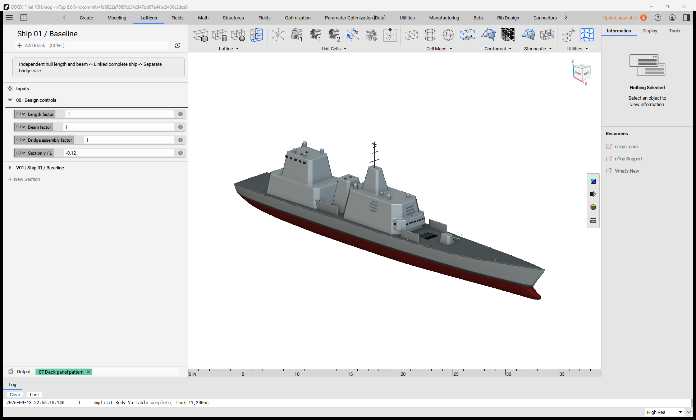

# DDG(X) construction: guide-driven attachments

Explore independent hull and bridge controls with deck-driven attachments in a native ship construction study.

This later construction master seats the uptake and other attachments on their intended supports. Recorded checks contain 465 attachment/support samples across ten versions. These contact checks do not establish joint strength or production readiness.

## Installation and use

1. Download the package files and keep them together.
2. Open `ddgx-construction-controls.ntop` in the matching licensed nTop build.
3. Save a working copy before editing. Expand the relevant section and change one control at a time.
4. Inspect the rebuilt bodies and block states before accepting the changed model.

Recorded native build: **6.0.0-rc 42594**. The catalogue version field cannot encode the custom build number. Public release compatibility has not been re-tested. The application and license are not included.

## Inputs and outputs

| Direction | Contents |
|---|---|
| Input | Hull, beam, bridge and section controls |
| Output | Hull, structure, superstructure and supported exterior details |

Named scalar controls include `Length factor`, `Beam factor`, `Bridge assembly factor`, `Section y / L`, `Normalized hull length`, `Aft hangar block height`, `Aft hangar block base height`, `Aft upper deckhouse height`, `Aft upper deckhouse base height`, `Forward deckhouse height`, `Forward deckhouse base height`, `Forward bridge height`. Some are computed values; inspect their upstream construction before changing them.

## Files

- [ddgx-construction-controls.ntop](ddgx-construction-controls.ntop)

## Evidence and source

Publication checks are offline: native-container round trips, export-path changes, collapsed presentation, dependency inspection, and binary payload preservation. These checks do not constitute new native execution. See [publication-checks.json](publication-checks.json).

## License

MIT. See [LICENSE](LICENSE). This license covers the original example models, saved recipes, and supporting material in this package.
