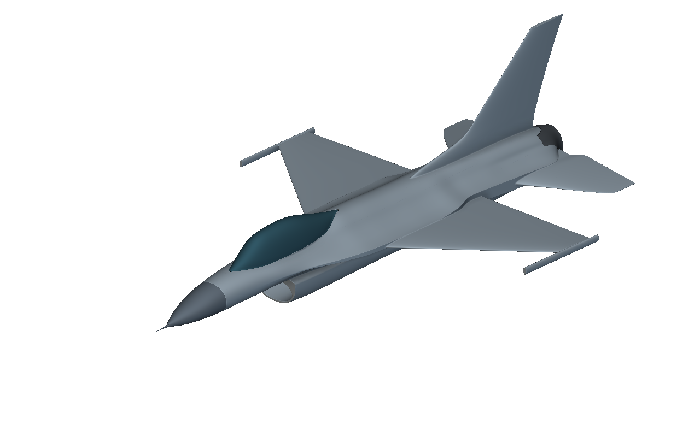

# F-16 R6: fair airfoils and finite trailing edges

Inspect the R6 aircraft appearance study with fair airfoils, revised aft-fuselage guides, and finite trailing edges.

The saved graph preserves R6 geometry and editable controls. Earlier cross-CAD comparisons use R3 and must not be treated as R6 measurements. Replay does not repeat the original fitting process.

## Installation and use

1. Download the package files and keep them together.
2. Open `f16-fair-airfoils-r6.ntop` in the matching licensed nTop build.
3. Save a working copy before editing. Expand the relevant section and change one control at a time.
4. Inspect the rebuilt bodies and block states before accepting the changed model.

Recorded native build: **6.0.0-rc 42594**. The catalogue version field cannot encode the custom build number. Public release compatibility has not been re-tested. The application and license are not included.

## Inputs and outputs

| Direction | Contents |
|---|---|
| Input | Saved native guide and airfoil controls |
| Output | Editable aircraft exterior and component geometry |

Named scalar controls include `Wingspan`, `Scale factor`, `Fuselage width multiplier`, `Fuselage height multiplier`, `Canopy height multiplier`, `Wing thickness multiplier`, `Trailing edge thickness at 32 ft`, `Normalized trailing edge thickness`, `Wing tip chord multiplier`, `Wing tip twist slope`, `Tail thickness multiplier`, `Fin thickness multiplier`. Some are computed values; inspect their upstream construction before changing them.

## Files

- [f16-fair-airfoils-r6.ntop](f16-fair-airfoils-r6.ntop)

## Evidence and source

Publication checks are offline: native-container round trips, export-path changes, collapsed presentation, dependency inspection, and binary payload preservation. These checks do not constitute new native execution. See [publication-checks.json](publication-checks.json).

The [source, usage notes, and recorded report](https://github.com/bradrothenberg/ntop-api-share/tree/92f13bc0a873aacba62526ee43e9e6895ef051f8/demos/f16) retain the original construction and verification scope. Download the public source checkout to view reports with their local assets.

## License

MIT. See [LICENSE](LICENSE). This license covers the original example models, saved recipes, and supporting material in this package.
