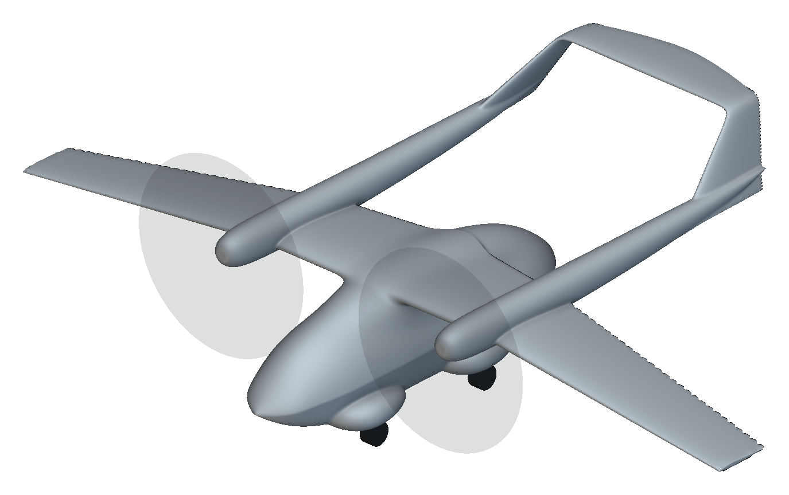

# F-Cat: continuous tail and cargo-pod fairing

Inspect an editable twin-boom aircraft with a continuous bent tail, cargo-pod fairing, chine, wheels, and a separate meshing presentation.

The geometry snapshot preserves the continuous tail and pod study. The linked aerodynamic results are recorded solver studies. Opening or replaying the model does not rerun them.

## Installation and use

1. Download the package files and keep them together.
2. Open `fcat-tail-and-cargo-pod.ntop` in the matching licensed nTop build.
3. Save a working copy before editing. Expand the relevant section and change one control at a time.
4. Inspect the rebuilt bodies and block states before accepting the changed model.

Recorded native build: **6.0.0-rc 42594**. The catalogue version field cannot encode the custom build number. Public release compatibility has not been re-tested. The application and license are not included.

Export destinations use filenames instead of source-workstation paths. Set your own output folder before enabling or running an export. Geometry inputs do not require external files.

## Inputs and outputs

| Direction | Contents |
|---|---|
| Input | Native wing, pod, and continuous-tail controls |
| Output | Aircraft geometry and a separate meshing notebook |

Named scalar controls include `Wingspan`, `Wing area`, `Wing area with units`, `Wing taper ratio`, `Longitudinal scale`, `Cargo pod width multiplier`, `Cargo pod height multiplier`, `Pod chine height fraction`, `Pod chine tangent strength`, `Cargo pod lower conic rho`, `Boom lateral station`, `Boom cross section multiplier`. Some are computed values; inspect their upstream construction before changing them.

## Files

- [fcat-tail-and-cargo-pod.ntop](fcat-tail-and-cargo-pod.ntop)
- [meshing.ntop](meshing.ntop)

## Evidence and source

Publication checks are offline: native-container round trips, export-path changes, collapsed presentation, dependency inspection, and binary payload preservation. These checks do not constitute new native execution. See [publication-checks.json](publication-checks.json).

The [source, usage notes, and recorded report](https://github.com/bradrothenberg/ntop-api-share/tree/92f13bc0a873aacba62526ee43e9e6895ef051f8/demos/fcat) retain the original construction and verification scope. Download the public source checkout to view reports with their local assets.

## License

MIT. See [LICENSE](LICENSE). This license covers the original example models, saved recipes, and supporting material in this package.
