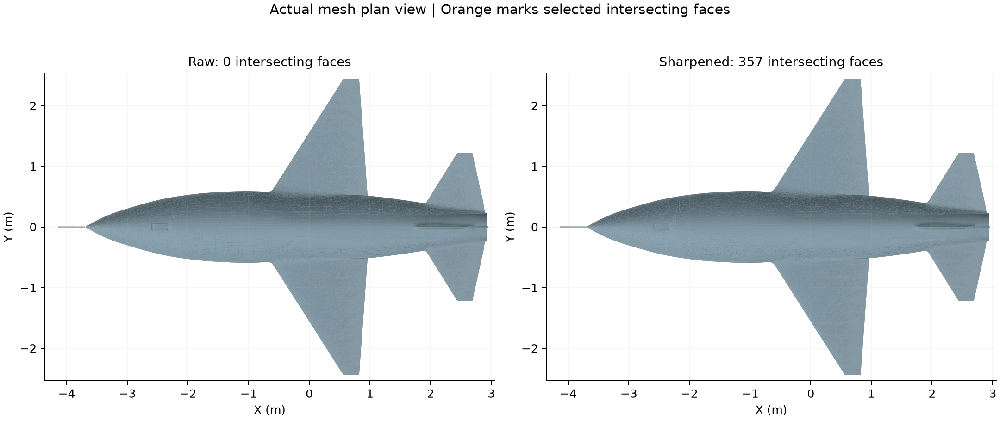

# Fury RC: finite trailing-edge geometry

**Built with Astra.**

Inspect the native Fury RC appearance study with finite trailing edges, editable loft guides, and retained mesh-readiness lessons.

The primary notebook has 0.5 inch full trailing-edge thickness on the wing, horizontal tail, and fin. Meshing and exports remain paused. Earlier appearance and layout notebooks are included with explicit earlier filenames. The linked algorithmic builder reconstructs the earlier baseline. Recorded mesh defects remain unresolved.

## Installation and use

1. Download the package files and keep them together.
2. Open `fury-rc-finite-edges.ntop` in the matching licensed nTop build.
3. Save a working copy before editing. Expand the relevant section and change one control at a time.
4. Inspect the rebuilt bodies and block states before accepting the changed model.

Recorded native build: **6.0.0-rc 42594**. The catalogue version field cannot encode the custom build number. Public release compatibility has not been re-tested. The application and license are not included.

Export destinations use filenames instead of source-workstation paths. Set your own output folder before enabling or running an export. Geometry inputs do not require external files.

## Inputs and outputs

| Direction | Contents |
|---|---|
| Input | Native guide splines and shape controls |
| Output | Finite-edge RC exterior; earlier appearance and layout views |

Named scalar controls include `RC wingspan`, `RC scale factor`, `Fuselage width multiplier`, `Fuselage height multiplier`, `Inlet lower depth multiplier`, `Upper conic rho adjustment`, `Inlet lip forward projection`, `Inlet lip thickness`, `Inlet lip center gap`, `Gap splitter start station`, `Gap splitter aft station`, `Gap splitter inlet-roof offset`. Some are computed values; inspect their upstream construction before changing them.

## Files

- [fury-rc-finite-edges.ntop](fury-rc-finite-edges.ntop)
- [earlier-appearance.ntop](earlier-appearance.ntop)
- [earlier-internal-layout.ntop](earlier-internal-layout.ntop)
- [earlier-gear-illustration.ntop](earlier-gear-illustration.ntop)

## Evidence and source

Publication checks are offline: native-container round trips, export-path changes, collapsed presentation, dependency inspection, and binary payload preservation. These checks do not constitute new native execution. See [publication-checks.json](publication-checks.json).

The [source, usage notes, and recorded report](https://github.com/bradrothenberg/ntop-api-share/tree/92f13bc0a873aacba62526ee43e9e6895ef051f8/demos/fury) retain the original construction and verification scope. Download the public source checkout to view reports with their local assets.

## License

MIT. See [LICENSE](LICENSE). This license covers the original example models, saved recipes, and supporting material in this package.
