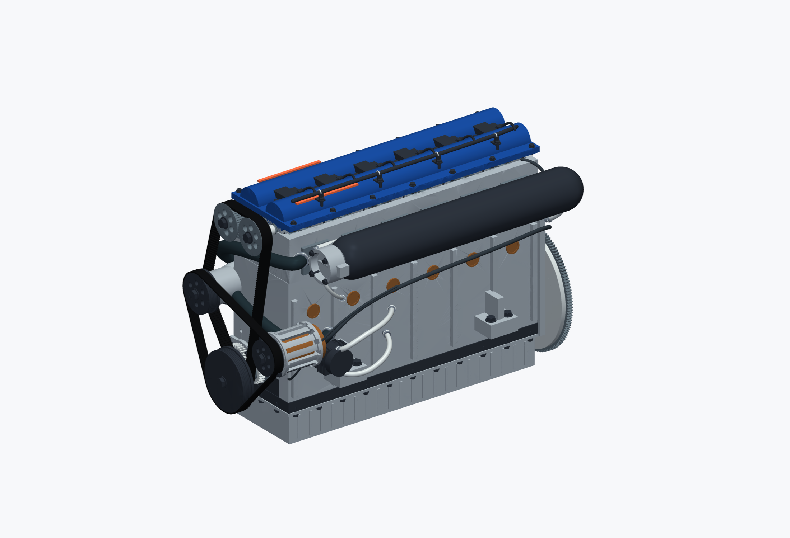

# Inline-six Astra: gears, belts, and service routes

Inspect a native inline-six assembly with involute gears, nominal fasteners, belts, spline routes, and mechanism checks.

The main and inspection presentations retain the editable construction graph. Nominal hardware and kinematic checks do not qualify a running engine.

## Installation and use

1. Download the package files and keep them together.
2. Open `inline-six-astra.ntop` in the matching licensed nTop build.
3. Save a working copy before editing. Expand the relevant section and change one control at a time.
4. Inspect the rebuilt bodies and block states before accepting the changed model.

Recorded native build: **6.0.0-rc 42594**. The catalogue version field cannot encode the custom build number. Public release compatibility has not been re-tested. The application and license are not included.

## Inputs and outputs

| Direction | Contents |
|---|---|
| Input | Named mechanism and component controls |
| Output | Separate engine bodies and an inspection presentation |

Named scalar controls include `Bore`, `Stroke`, `Cylinder pitch`, `Connecting rod centers`, `Compression height`, `Crank angle`, `Deck height`, `Intake valve diameter`, `Exhaust valve diameter`, `Valve inclination`, `Gear module`, `Gear pressure angle`. Some are computed values; inspect their upstream construction before changing them.

## Files

- [inline-six-astra.ntop](inline-six-astra.ntop)
- [inspection.ntop](inspection.ntop)

## Evidence and source

Publication checks are offline: native-container round trips, export-path changes, collapsed presentation, dependency inspection, and binary payload preservation. These checks do not constitute new native execution. See [publication-checks.json](publication-checks.json).

The [source, usage notes, and recorded report](https://github.com/bradrothenberg/ntop-api-share/tree/92f13bc0a873aacba62526ee43e9e6895ef051f8/demos/i6-astra) retain the original construction and verification scope. Download the public source checkout to view reports with their local assets.

## License

MIT. See [LICENSE](LICENSE). This license covers the original example models, saved recipes, and supporting material in this package.
