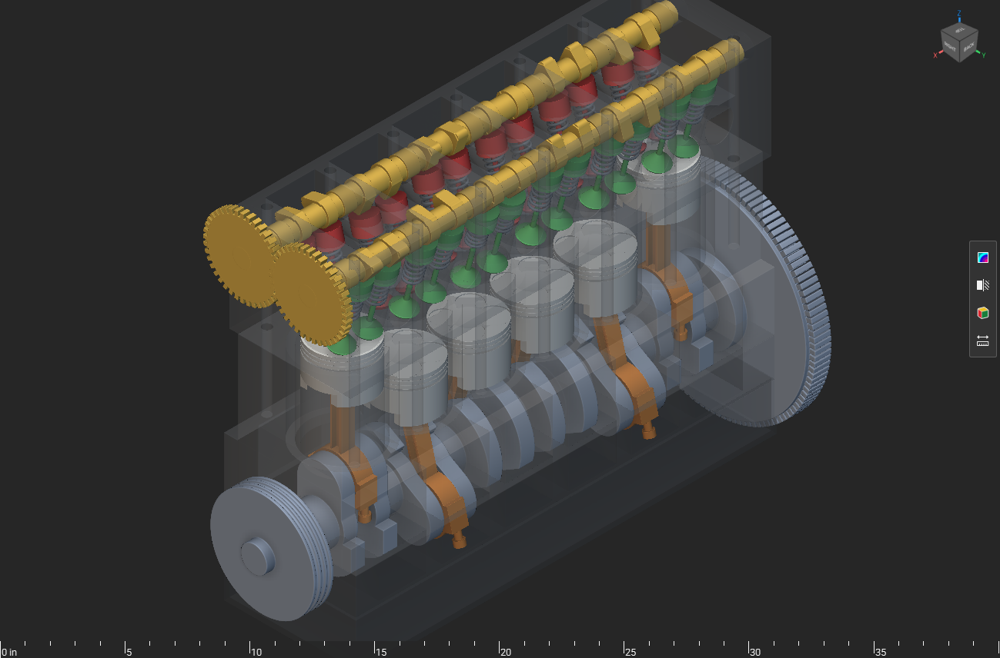

# Inline-six engine: editable mechanism study

Explore slider-crank kinematics, cam-driven valves, and analytic helical springs in an editable native inline-six engine.

The original engine demonstrates a complete API recorder and a parametric mechanical assembly. The report retains recorded mechanism checks.

## Installation and use

1. Download the package files and keep them together.
2. Open `inline-six-engine.ntop` in the matching licensed nTop build.
3. Save a working copy before editing. Expand the relevant section and change one control at a time.
4. Inspect the rebuilt bodies and block states before accepting the changed model.

Recorded native build: **6.0.0-rc 42594**. The catalogue version field cannot encode the custom build number. Public release compatibility has not been re-tested. The application and license are not included.

Export destinations use filenames instead of source-workstation paths. Set your own output folder before enabling or running an export. Geometry inputs do not require external files.

## Inputs and outputs

| Direction | Contents |
|---|---|
| Input | Crank position and engine dimensions |
| Output | Crankshaft, rods, pistons, cams, valves, springs, block and covers |

Named scalar controls include `Bore`, `Stroke`, `Rod Length`, `Bore Pitch`, `Compression Height`, `Piston Length`, `Piston Clearance`, `Crown Thickness`, `Piston Wall`, `Dish Depth`, `Dish Sphere Radius`, `Top Land`. Some are computed values; inspect their upstream construction before changing them.

## Files

- [inline-six-engine.ntop](inline-six-engine.ntop)

## Evidence and source

Publication checks are offline: native-container round trips, export-path changes, collapsed presentation, dependency inspection, and binary payload preservation. These checks do not constitute new native execution. See [publication-checks.json](publication-checks.json).

The [source, usage notes, and recorded report](https://github.com/bradrothenberg/ntop-api-share/tree/92f13bc0a873aacba62526ee43e9e6895ef051f8/demos/i6) retain the original construction and verification scope. Download the public source checkout to view reports with their local assets.

## License

MIT. See [LICENSE](LICENSE). This license covers the original example models, saved recipes, and supporting material in this package.
