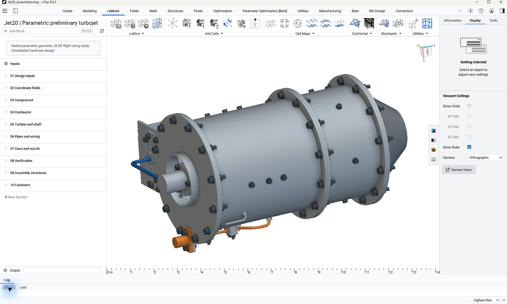

# Jet20: editable small turbojet assembly

Explore an editable compressor, combustor, turbine, housings, nominal fasteners, and service routes around a conditional 20 lbf sizing target.

This package contains assembled, inspection, and exploded presentations. The 20 lbf value is a conditional sizing target, not measured engine thrust.

## Installation and use

1. Download the package files and keep them together.
2. Open `jet20-engine-study.ntop` in the matching licensed nTop build.
3. Save a working copy before editing. Expand the relevant section and change one control at a time.
4. Inspect the rebuilt bodies and block states before accepting the changed model.

Recorded native build: **6.0.0-rc 42594**. The catalogue version field cannot encode the custom build number. Public release compatibility has not been re-tested. The application and license are not included.

## Inputs and outputs

| Direction | Contents |
|---|---|
| Input | Named component dimensions and assembly controls |
| Output | Compressor, combustor, turbine, housings and service-route bodies |

Named scalar controls include `Compressor exit radius`, `Compressor eye radius`, `Compressor eye hub radius`, `Compressor exit width`, `Turbine tip radius`, `Turbine hub radius`, `Turbine mean radius`, `Case radius`, `Case length`, `Shaft radius`, `Nozzle exit radius`, `Case wall`. Some are computed values; inspect their upstream construction before changing them.

## Files

- [jet20-engine-study.ntop](jet20-engine-study.ntop)
- [inspection.ntop](inspection.ntop)
- [exploded.ntop](exploded.ntop)

## Evidence and source

Publication checks are offline: native-container round trips, export-path changes, collapsed presentation, dependency inspection, and binary payload preservation. These checks do not constitute new native execution. See [publication-checks.json](publication-checks.json).

The [source, usage notes, and recorded report](https://github.com/bradrothenberg/ntop-api-share/tree/92f13bc0a873aacba62526ee43e9e6895ef051f8/demos/jet20) retain the original construction and verification scope. Download the public source checkout to view reports with their local assets.

## License

MIT. See [LICENSE](LICENSE). This license covers the original example models, saved recipes, and supporting material in this package.
