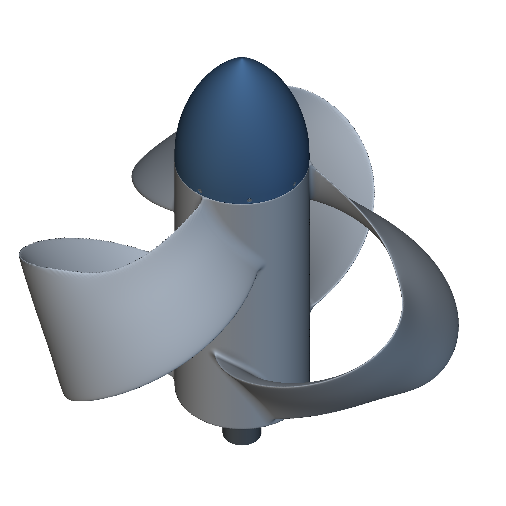

# Marine R5: return-loop propeller and drive

**Built with Astra.**

Inspect continuous leading-edge return loops, independent root trims, a finished aft shoulder, and separate ogive and drive components.

R5 retains physical leading-edge identity through the return and applies a finishing cut after the blade/barrel blend. The saved-graph orientation check covers seven trim cases with 121 stations each. The drive is a custom nominal interface. Marine performance and production fit are not qualified by these geometry checks.

## Installation and use

1. Download the package files and keep them together. The community download serves the full native notebook from public Git LFS storage. If cloning with Git, run `git lfs pull` to retrieve the model.
2. Open `marine-return-loop-propeller-r5.ntop` in the matching licensed nTop build.
3. Save a working copy before editing. Expand the relevant section and change one control at a time.
4. Inspect the rebuilt bodies and block states before accepting the changed model.

Recorded native build: **6.1.0-rc 42926**. The catalogue version field cannot encode the custom build number. Public release compatibility has not been re-tested. The application and license are not included.

Export destinations use filenames instead of source-workstation paths. Set your own output folder before enabling or running an export. Geometry inputs do not require external files.

## Inputs and outputs

| Direction | Contents |
|---|---|
| Input | Forward root twist trim; Aft root twist trim; nominal drive dimensions |
| Output | Marine screw, ogive, cartridge, reference shaft and retention hardware |

Named scalar controls include `Forward root twist trim`, `Aft root twist trim`, `CHECK Cartridge wall`, `CHECK Cartridge spline opening`, `CHECK Ogive wall`, `CHECK Ogive cavity`, `CHECK Barrel material`, `CHECK Open barrel bore`, `CHECK Foil inside station 12 x 0.4`, `CHECK Foil outside station 12 x 0.4`, `CHECK Foil inside station 12 x -0.4`, `CHECK Foil outside station 12 x -0.4`. Some are computed values; inspect their upstream construction before changing them.

## Files

- [marine-return-loop-propeller-r5.ntop](marine-return-loop-propeller-r5.ntop)

## Evidence and source

Publication checks are offline: native-container round trips, export-path changes, collapsed presentation, dependency inspection, and binary payload preservation. These checks do not constitute new native execution. See [publication-checks.json](publication-checks.json).

## License

MIT. See [LICENSE](LICENSE). This license covers the original example models, saved recipes, and supporting material in this package.
