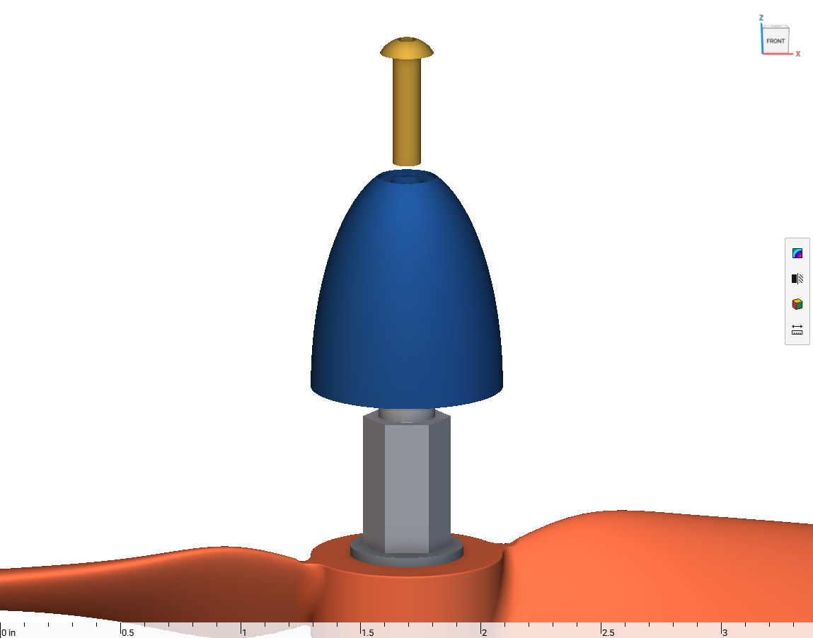

# Eight-inch propeller and retained spinner

**Built with Astra.**

Explore an editable propeller assembly with a separate spinner, motor reference, and nominal retention hardware.

The package includes the assembled propeller and a separate spinner notebook. The nominal retention geometry is a modeling example, not a released manufacturing drawing or safe-speed qualification.

## Installation and use

1. Download the package files and keep them together.
2. Open `propeller-eight-inch.ntop` in the matching licensed nTop build.
3. Save a working copy before editing. Expand the relevant section and change one control at a time.
4. Inspect the rebuilt bodies and block states before accepting the changed model.

Recorded native build: **6.1.0-rc 42926**. The catalogue version field cannot encode the custom build number. Public release compatibility has not been re-tested. The application and license are not included.

Export destinations use filenames instead of source-workstation paths. Set your own output folder before enabling or running an export. Geometry inputs do not require external files.

## Inputs and outputs

| Direction | Contents |
|---|---|
| Input | Native blade, hub, spinner and retention dimensions |
| Output | Propeller, spinner, reference motor and retention bodies |

Named scalar controls include `Diameter - design record`, `Geometric pitch - design record`, `Hub diameter - design record`, `Hub thickness - design record`, `Bore diameter - design record`, `CHECK Spinner shell`, `CHECK Spinner cavity`, `CHECK Spinner nose`, `CHECK Spinner rear opening`, `CHECK Adapter wall`, `CHECK Adapter upper wall`, `CHECK Screw material`. Some are computed values; inspect their upstream construction before changing them.

## Files

- [propeller-eight-inch.ntop](propeller-eight-inch.ntop)
- [spinner.ntop](spinner.ntop)

## Evidence and source

Publication checks are offline: native-container round trips, export-path changes, collapsed presentation, dependency inspection, and binary payload preservation. These checks do not constitute new native execution. See [publication-checks.json](publication-checks.json).

The [source, usage notes, and recorded report](https://github.com/bradrothenberg/ntop-api-share/tree/92f13bc0a873aacba62526ee43e9e6895ef051f8/demos/propellers) retain the original construction and verification scope. Download the public source checkout to view reports with their local assets.

## License

MIT. See [LICENSE](LICENSE). This license covers the original example models, saved recipes, and supporting material in this package.
