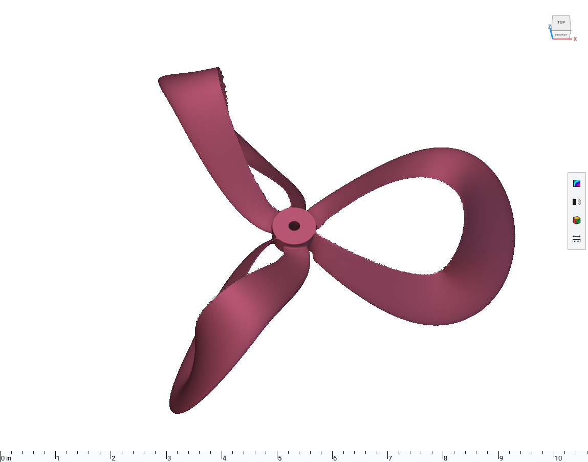

# Two-rail propeller studies: twenty editable graphs

Ten original blade forms and ten later airfoil candidates demonstrate two-rail sweeps, changing section frames, and closed loops.



This bundle distributes complete saved graphs in [studies.json](studies.json). It omits the large native caches and raw meshes. Replaying a graph creates the native editable model. It does not rerun the original design search or certify aerodynamic performance.

## Installation and use

Use a licensed nTop **6.1.0-rc build 42926** with the Notebook API. The catalogue version field cannot encode the custom build number. Public release compatibility has not been re-tested.

Download `studies.json` and save it in your working folder. Open an empty, task-owned nTop notebook. Set `folder` and `case_id` in the Python Console code below. Choose a new output folder for each replay.

```python
from pathlib import Path
import json

folder = Path(r"C:/path/to/your/download")
case_id = "airfoil_07_three_petal"
data = json.loads((folder / "studies.json").read_text())
case = next(c for c in data["cases"] if c["id"] == case_id)
out = folder / (case_id + "-replay")
if out.exists():
    raise RuntimeError("Choose a new output folder; preserve earlier work")
if notebook.list_variables() or any(notebook.list_blocks(s["id"]) for s in notebook.list_sections()):
    raise RuntimeError("Use an empty task-owned notebook")
out.mkdir()

def resolve(value):
    if isinstance(value, dict):
        return {k: resolve(v) for k, v in value.items()}
    if isinstance(value, list):
        return [resolve(v) for v in value]
    if isinstance(value, str) and value.startswith("repo://"):
        return str(out / value.rsplit("/", 1)[-1])
    return value

recipe_path = out / "recipe.json"
recipe_path.write_text(json.dumps(resolve(case["recipe"])))
notebook.import_recipe(str(recipe_path))
notebook.export_as_recipe(str(out / "readback.json"))
notebook.save_notebook_as(str(out / "model-working.ntop"))
```

Wait for the import and save to finish. Inspect native block states, the saved readback, and the geometry. Preserve the working save and collapse authored blocks and sections in a separate final copy. The import does not preserve the original viewport presentation.

## Inputs and outputs

| Direction | Contents |
|---|---|
| Input | Case ID and the saved rail, section, and frame controls |
| Output | Native editable blade graph, working notebook, and recipe readback |

## Cases

| Case ID | Profile | Study |
|---|---|---|
| `elliptical_01_scimitar` | Elliptical section | Scimitar |
| `elliptical_02_gull_wing` | Elliptical section | Gull wing |
| `elliptical_03_scalloped` | Elliptical section | Scalloped |
| `elliptical_04_high_twist` | Elliptical section | High twist |
| `elliptical_05_round_mobius` | Elliptical section | Round Mobius |
| `elliptical_06_elliptical_mobius` | Elliptical section | Elliptical Mobius |
| `elliptical_07_three_petal` | Elliptical section | Three-petal screw |
| `elliptical_08_four_petal` | Elliptical section | Four-petal screw |
| `elliptical_09_three_loop` | Elliptical section | Three-loop toroidal |
| `elliptical_10_folded_loop` | Elliptical section | Folded-loop propeller |
| `airfoil_01_scimitar` | NACA 0015 | Scimitar |
| `airfoil_02_gull_wing` | NACA 0015 | Gull wing |
| `airfoil_03_scalloped` | NACA 0015 | Scalloped |
| `airfoil_04_high_twist` | NACA 0015 | High twist |
| `airfoil_05_round_mobius` | NACA-derived symmetric ribbon; NACA 0030 supports | Round Mobius |
| `airfoil_06_elliptical_mobius` | NACA-derived symmetric ribbon; NACA 0030 supports | Elliptical Mobius |
| `airfoil_07_three_petal` | NACA 0015 | Three-petal screw |
| `airfoil_08_four_petal` | NACA 0015 | Four-petal screw |
| `airfoil_09_three_loop` | NACA 0015 | Three-loop toroidal |
| `airfoil_10_folded_loop` | NACA-derived fore-aft symmetric ribbon | Folded Mobius propeller |

## Evidence and limits

The [publication checks](publication-checks.json) verify all twenty complete recipes offline. Recorded mesh values refer to their earlier native source revisions. No new native execution is claimed. Modified Mobius sections remain labeled; the folded Mobius retains visible edge ripples and is a topology study. These models are not accepted aerodynamic optima.

The [audited source collection](https://github.com/bradrothenberg/ntop-api-share/tree/92f13bc0a873aacba62526ee43e9e6895ef051f8/demos/propellers) includes the native gallery, recorded measurements, replay tooling, and CFD plan.

## License

MIT. See [LICENSE](LICENSE). This license covers the original example models, saved recipes, and supporting material in this package.
