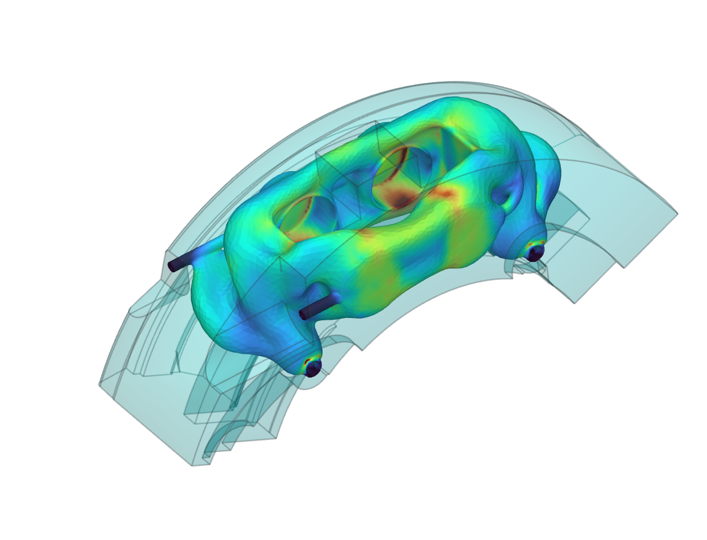

# Brake Caliper Topology Optimization Workflow

A complete topology optimization workflow for a brake caliper, built in nTop. It runs from imported CAD to a smoothed, validated and exportable part.



## Installation

Download `brake-caliper-topology-optimization.ntop` from the community site, or clone this repo:

```bash
git clone https://github.com/nTopology/Utilities-community.git
```

The package lives at `packages/matthewmuellernTop/brake-caliper-topology-optimization/`. The caliper CAD is embedded in the notebook, so no external files are needed.

## Workflow

The notebook is organized into these sections, in order:

| Section | What it does |
|---------|--------------|
| Model Importation | Embedded caliper CAD: design space, pistons, pads, screws and fluid passages |
| Load surfaces / From CAD Faces to Body | Selects the CAD faces used for loads and supports, and converts the bodies to implicits |
| Meshing | Surface and volume meshing for the FE model |
| FE Boundaries / Loads and constraints | Boundaries from CAD faces, plus loads and restraints on the pistons, pads and screws |
| Static Analysis | Baseline static analysis of the design space |
| Objectives, Constraints and Model | Optimization objective, stress constraint and volume-fraction constraint |
| Topology Optimization | Runs the optimization |
| Smoothening and post processing | Smooths the result and restores the fluid passages and interfaces |
| Validation | Remeshes the smoothed part and reruns a static analysis (von Mises stress) |
| Field Driven Design / Exporting | Post-processing and export of the final part |

## Usage

1. Open `brake-caliper-topology-optimization.ntop` in nTop 6.1 or later. It was prepared with nTop 6.1.2.
2. Save a working copy.
3. Review the loads and constraints and the optimization constraints for your use case, then run the topology optimization.
4. Check the validation analysis before using the result.
5. To export, set the export **File Path** to a local folder.

## Notes

The export **File Path** is intentionally blank in this copy. The notebook is byte-identical to the shared source and was not re-evaluated in nTop for this submission. Review the loads, constraints and material for your own caliper before relying on the results.

## License

MIT. See [LICENSE](LICENSE).
