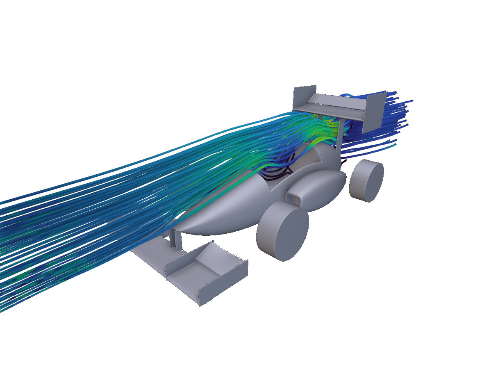

# FSAE Aero Package

A parametric aerodynamic package for a Formula SAE car, built in nTop. The notebook models the front wing and endplates, the rear wing and endplates, the body and mounts, and the wheels as separate sections, and assembles them into a whole-car body for flow analysis.



## Installation

Download `fsae-aero-package.ntop` from the community site, or clone this repo:

```bash
git clone https://github.com/nTopology/Utilities-community.git
```

The package lives at `packages/matthewmuellernTop/fsae-aero-package/`. The notebook is self-contained: it has no external file dependencies, such as CAD, CSV airfoils or meshes.

## Usage

1. Open `fsae-aero-package.ntop` in nTop 6.1 or later. It was prepared with nTop 6.1.2.
2. Save a working copy.
3. Edit the wing sections. The airfoils are NACA 4-digit sections (2412, 4412 and 6412 are used in the notebook).
4. Edit the body using the fuselage-from-rails controls: Top, Side and Bottom rails, Top/Bottom Rho, and Tip/Rear Close Blend Radius.
5. Use the **Wings only** or **Whole car** body for flow analysis. The notebook's results table lists downforce, drag and L/D by part.

## Notebook layout

| Section | What it contains |
|---------|------------------|
| Front wing and endplates | Multi-element front wing built from NACA 4-digit profiles, with endplates |
| Rear wing and endplates | Rear wing elements, endplates and mounts |
| Body and mounts | Fuselage built from Top, Side and Bottom rails, with Top/Bottom Rho and Tip/Rear Close Blend Radius controls |
| Wheels | Wheel bodies for the whole-car configuration |
| Wings only / Whole car | Combined bodies for analysing the wings alone or the complete car |
| Results table | Part, Downforce (N), Drag (N) and L/D |

## Notes

This publication copy is byte-identical to the shared source notebook. It was not reopened or re-evaluated in nTop for this submission. Flow results depend on your own analysis settings and are not a validated design claim.

## License

MIT. See [LICENSE](LICENSE).
