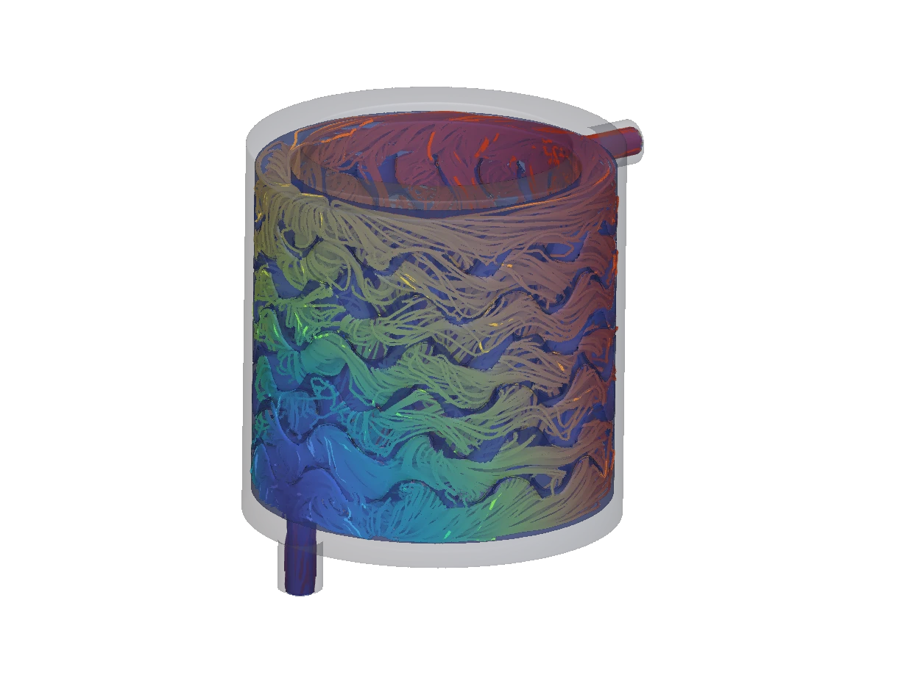

# FSAE Motor Cooling Sleeve: Gyroid CHT

A parametric water-cooling sleeve for a Formula SAE EV motor, built in nTop. A walled gyroid lattice fills the coolant annulus around the stator. The notebook runs a conjugate heat transfer (CHT) analysis to check pressure drop and stator bore temperature.



## Installation

Download `fsae-cooling-sleeve-gyroid-cht.ntop` from the community site, or clone this repo:

```bash
git clone https://github.com/nTopology/Utilities-community.git
```

The package lives at `packages/matthewmuellernTop/fsae-cooling-sleeve-gyroid-cht/`. The notebook has no external file dependencies.

## Usage

1. Open `fsae-cooling-sleeve-gyroid-cht.ntop` in nTop 6.1 or later. It was prepared with nTop 6.1.2.
2. Save a working copy.
3. Set the motor and coolant inputs: Bore Radius, Active Length, Heat Load, Coolant Flow Rate and Coolant Inlet Temp.
4. Shape the jacket: Channel Depth, Gyroid Cell Size, wall thicknesses, Plenum Height and port size.
5. Set **Cell Size** (the LBM grid), then run **Gyroid CHT Analysis**. Use 2 mm for DoE screening and 1 mm for final checks.

## Defaults

| Input | Default basis |
|-------|---------------|
| Bore Radius / Active Length | Typical FSAE EV inboard PMSM: 120 mm stator, 150 mm stack |
| Heat Load | About 1.5 kW continuous, for an approximately 80 kW motor, applied as uniform flux on the stator bore |
| Coolant Flow Rate | 8 L/min water (typical FSAE pump) |
| Coolant Inlet Temp | 40 °C radiator-out |
| Port Radius | Ø12 mm ports (typical -8 AN / 1/2" fitting) |
| Gyroid Cell Size | 43 mm, which gives 10 cells around the mid-channel circumference |
| Channel Depth | 16 mm (8 LBM cells across at 2 mm) |

The gyroid sheet thickness is tied to 1.5 × the LBM cell size so that the sheet always resolves. The sleeve material is 6061 aluminum. The coolant is a custom water material with thermal properties, because CHT needs k and cp on the fluid.

## Outputs

| Output | Notes |
|--------|-------|
| Cooling Sleeve | Solid 6061 sleeve: blank minus coolant volume |
| Coolant Body | Fluid volume: annular jacket minus lattice, plus ports |
| Pressure Drop | Inlet minus outlet pressure |
| Bore Temperature | Time-averaged stator bore temperature (lower is better) |
| Coolant Outlet Temperature | Average temperature at the outlet face |
| DoE Outputs | `[Pressure Drop (Pa), Bore Temperature (K), Coolant Outlet Temperature (K)]` for nTop Automate |

## Notes

This copy was saved without analysis results, so run **Gyroid CHT Analysis** yourself to get the pressure and temperature outputs. The notebook is byte-identical to the shared source and was not re-evaluated in nTop for this submission. Treat the results as exploratory screening unless you run the analysis at the finer cell size.

## License

MIT. See [LICENSE](LICENSE).
