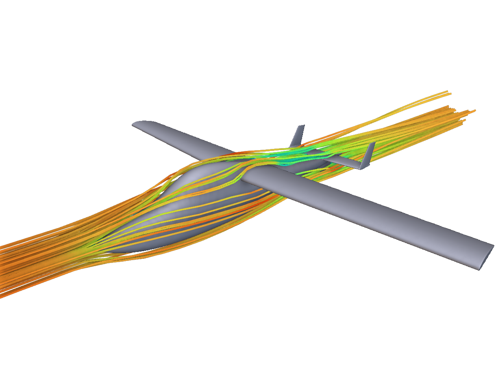

# Lesher Teal Hackathon Starter with Quick Aero Estimates

A parametric nTop model of the Lesher Teal, the record-setting pusher aircraft that
University of Michigan professor Edgar J. Lesher designed and first flew in 1965. It's
the starter file for a student hackathon challenge: parameterize the aircraft so it
captures the designer's intent, then pull out parameters for a design of experiments.

The built-in Aircraft Flow Analysis gives high-fidelity results but takes a while to
solve. This package adds a **Quick Aero Estimate** section: an nTop **Run Command**
block sends the current geometry to a small Python script, which uses
[AeroSandbox](https://github.com/peterdsharpe/AeroSandbox) and reports cruise CL, CD,
L/D, max L/D, neutral point and static margin within about 3 seconds of any change.

The aero integration (`teal_aero.py` and the Run Command chain) was built with Claude.



## Files

| File | Purpose |
|---|---|
| `lesher-teal-hackathon-starter.ntop` | The notebook: wing, fuselage and tail geometry, checks, flow analysis and the Quick Aero Estimate section |
| `teal_aero.py` | Quick aero script called by the notebook; also usable from a terminal |
| `requirements.txt` | Python dependency (`aerosandbox`) |
| `aero-output-example.png` | Example of the plot the script writes |

The site's download button gives you a zip with the notebook, `teal_aero.py`,
`requirements.txt`, this README and the license. `aero-output-example.png` and the
publication record are only in the
[package folder on GitHub](https://github.com/nTopology/Utilities-community/tree/main/packages/matthewmuellernTop/lesher-teal-hackathon-starter).

## Setup (about 5 minutes)

1. Install Python 3.9 or newer from [python.org](https://www.python.org/downloads/)
   and tick **Add python.exe to PATH**.
2. Install AeroSandbox:

   ```bash
   pip install aerosandbox
   ```

3. Create the folder `C:\TealAero` and put `teal_aero.py` in it. To use a different
   folder, change the notebook's **Aero Tool Folder** variable to match, using forward
   slashes.
4. Check the script works (it prints the baseline estimate):

   ```bash
   python C:\TealAero\teal_aero.py
   ```

5. Open `lesher-teal-hackathon-starter.ntop` in nTop 6.2 or later and save a working copy.
6. The first time the notebook runs, nTop asks you to **Trust** the Run Command block.
   Click Trust.

If AeroSandbox is installed in a different Python (a venv or conda env), set
**Python Executable** to that interpreter's full path.

## Using it

Every aero-relevant input is a named variable, in the Wings, Fuselage, Stabilizers
and Mass Estimate sections:

- **Wing:** root point (its placement), chord, airfoil, span, sweep, taper, twist, dihedral
- **H-stab:** the same eight inputs
- **Twin fins** (`VStab`): root point, chord, airfoil, height, sweep, taper
- **Ventral fin:** root point (`Lower Stab Root`), chord, airfoil, height, sweep, taper
- **Fuselage:** the top, side and bottom rail point lists
- **Mass Estimate:** a mass and a point location for each of payload, engine, structures
  and fuel (rough estimates that total the 500 kg max takeoff weight). A group weight
  statement block turns them into the total mass and CG the aero estimate uses.

Both the geometry blocks and the aero estimate read these variables. When you replace a
typed value with an expression on your own design parameters, the estimate follows
automatically.

| Direction | Name | Meaning |
|---|---|---|
| Input | Wing, H-stab, fin, ventral and fuselage variables | Geometry, in model units |
| Input | Payload, Engine, Structures and Fuel Mass and Location | Mass Estimate section: kg and m for each group |
| Input | Cruise Speed (m per s) | m/s (82 = 160 kn) |
| Output | Total Mass, Mass Statement CG | Group weight statement result; drives Aircraft Mass and CG X |
| Output | Aircraft Mass, CG X | Mass and CG sent to the aero script; static margin is measured about CG X |
| Output | Cruise CL, Cruise CD, Cruise L/D | At the cruise mass and speed, sea level |
| Output | Max L/D | Best lift-to-drag ratio over angle of attack |
| Output | Neutral Point X, Static Margin pct MAC | Pitch stability |
| Output | Neutral Point, CG Point | Viewport markers; keep the neutral point behind the CG |

Each run also writes `aero_results.json` and `aero_results.png` (polars plus top and side
views) next to the script, so you can check the geometry was read correctly.

If an estimate doesn't appear, copy the text of **Aero Command Line** into a terminal and
run it to see the error.

### From a terminal (DOE)

Any key you leave out keeps its Teal baseline value. Lengths are in m, angles in deg.

```bash
python teal_aero.py wing.span=8 wing.x=2.4 hstab.chord=0.6 mass=520
python teal_aero.py --list
```

`--list` prints every key with its baseline value. Add `--csv doe.csv --no-plot` to each
run to collect a sweep into one CSV.

## Evidence and limits

- The notebook was prepared and checked in an internal nTop build (43139, with the
  Notebook API). This publication copy was not reopened in a public nTop 6.2 release.
- In that build, Run Command produced the estimate shown above: cruise L/D 14.2,
  neutral point 2.753 m. Wing-placement and tail changes updated it as expected, and
  the script matches a direct terminal run.
- The flow analysis is included but paused, without results; run it yourself.
- This is a quick estimate:
  - Drag covers only the wing, tails and fuselage. Propeller, cooling, gear and
    interference drag are left out, so real power is higher.
  - CL_max and stall speed are rough.
  - Moments are untrimmed (no elevator deflection).
  - A positive twist value is read as washout, and the tip gets half of it because the
    wing block ramps twist over the full span.
  - Fuselage sections are modeled as ellipses through the rails.
- Use it to rank designs, then check final candidates with the flow analysis.

## License and credits

The notebook and script are released under the MIT license; see [LICENSE](LICENSE).

- The notebook description embeds the photo
  [Lesher Teal](https://commons.wikimedia.org/wiki/File:Lesher_Teal.jpg) by FlugKerl2,
  licensed [CC BY-SA 3.0](https://creativecommons.org/licenses/by-sa/3.0/). That photo
  isn't covered by the MIT license.
- Aircraft dimensions and performance figures are from the
  [Lesher Teal Wikipedia article](https://en.wikipedia.org/wiki/Lesher_Teal).
- [AeroSandbox](https://github.com/peterdsharpe/AeroSandbox) (MIT) is a dependency, not
  bundled.
