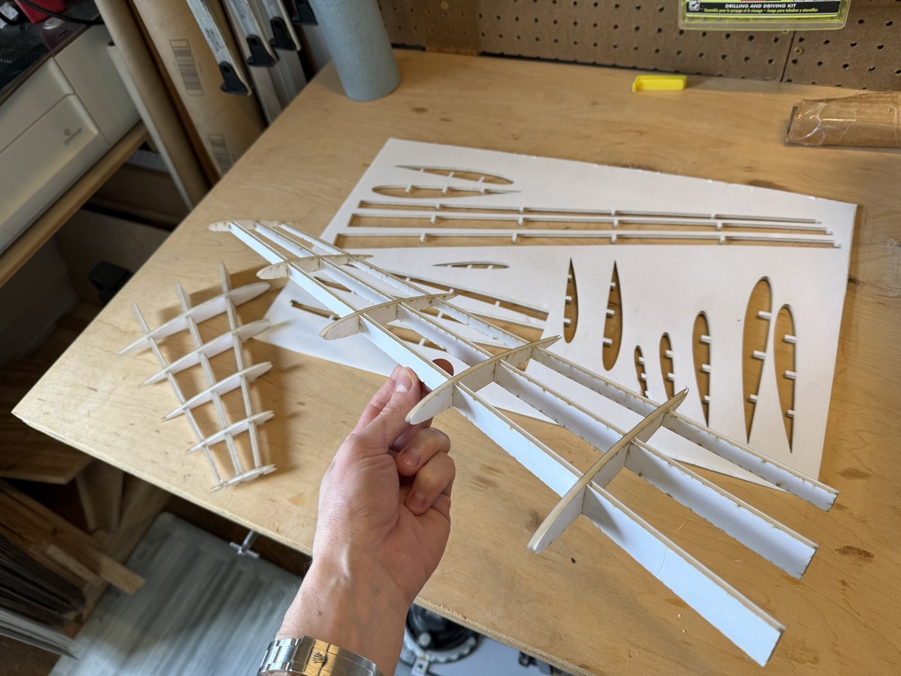

# Single Panel Wing Laser Cut Structure

A parametric wing in nTop that generates a flat-pack rib-and-spar structure for laser cutting. You set the airfoil and planform, and the notebook builds slotted ribs and spars that interlock. It then exports their profiles as a 3MF file. The included Python script turns that 3MF into true-size SVG cut files, one per part.



## Files

| File | Purpose |
|------|---------|
| `single-panel-wing-laser-cut-structure.ntop` | The nTop notebook: wing definition, rib and spar layout, and 3MF export |
| `slices3mf_to_cut.py` | Converts the exported 3MF slice profiles into SVG files for laser cutting |

The site's download button gives you the notebook. Get the script from [this package folder on GitHub](https://github.com/nTopology/Utilities-community/tree/main/packages/matthewmuellernTop/single-panel-wing-laser-cut-structure), or clone the whole repo:

```bash
git clone https://github.com/nTopology/Utilities-community.git
```

## Usage

1. Open `single-panel-wing-laser-cut-structure.ntop` in nTop 6.1 or later. It was prepared with nTop 6.1.2.
2. Save a working copy.
3. Set the wing inputs: NACA 4-digit code (default 2412), Root Chord Length, Wing Span, Taper Ratio, LE Angle (sweep) and twist.
4. Set **Lattice Path** to where the 3MF of rib and spar profiles should be written.
5. Convert the 3MF to SVGs, using either the notebook or a terminal (see the next section).

## Converting the 3MF to SVG

The script needs Python 3.8+ and numpy.

```bash
python -m pip install numpy
python slices3mf_to_cut.py WingStructsSlices.3mf
```

With [uv](https://docs.astral.sh/uv/) installed, `uv run slices3mf_to_cut.py WingStructsSlices.3mf` installs numpy automatically.

This writes one SVG per flat part into a `<name>_svg` folder next to the 3MF. Parts are drawn at true size in millimeters. Outer profiles are red, holes blue, and any outline that could not be closed is green; check green outlines before cutting.

| Option | Effect |
|--------|--------|
| `-o FOLDER` | Write the SVGs to a different folder |
| `--split-parts` | Write each separate part on a plane as its own SVG |
| `--gap-tol MM` | Close gaps in outlines up to this size (default: 3 × the median segment length) |
| `--margin MM` | Margin around each part (default 2 mm) |
| `--stroke MM` | SVG stroke width (default 0.1 mm) |

The script works with any 3MF that contains beam-lattice or slice-stack profiles, not just this notebook's output.

### Running the script from nTop

The notebook's **Run Command** block can call the script right after export. In this copy its paths are blank. To use it:

1. Set **Lattice Path** to the 3MF output location.
2. Set **Python Script Path** to your copy of `slices3mf_to_cut.py`. Use a path without spaces, because the command does not quote it.
3. Make sure `python` on your PATH has numpy installed.

The block runs `python <Python Script Path> "<Lattice Path>"`. nTop asks you to trust the file or block before any Run Command executes.

## Notes

The notebook is byte-identical to the shared source and was not re-evaluated in nTop for this submission. Measure your sheet thickness and test-cut a slot before cutting the full set, since slot fit depends on your material and laser kerf.

## License

MIT. See [LICENSE](LICENSE).
