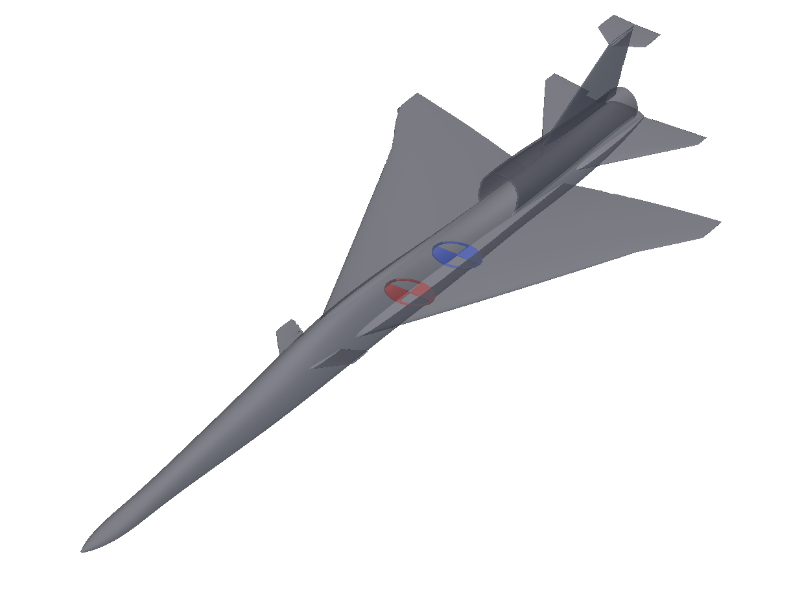
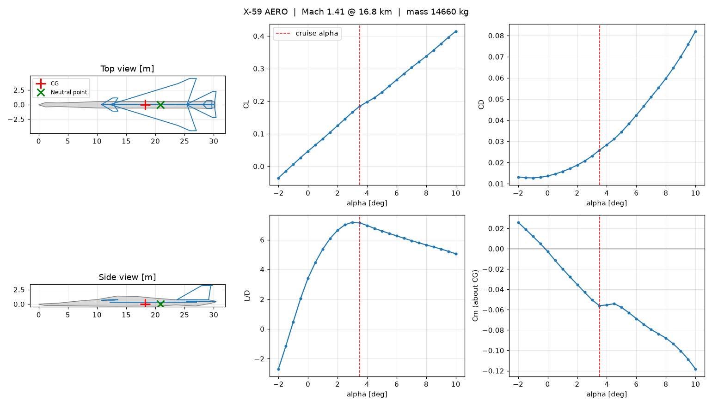

# X-59 Hackathon Starter with Quick Aero Estimates

A parametric nTop model of an X-59-style low-boom supersonic demonstrator. It's a starter
file for a student hackathon: change the wing, canards or tail, and see how cruise
efficiency and pitch stability respond.

The notebook includes a **Mass Estimates** section, a group mass statement with payload,
engine, structures and fuel at point locations. It also has an **Aero Analysis**
section, where an nTop **Run Command** block sends the current geometry, mass and CG to
a small Python script. The script uses
[AeroSandbox](https://github.com/peterdsharpe/AeroSandbox) and reports cruise CL, CD,
L/D, drag, pitching moment, neutral point and static margin in about 2 seconds.

The aero integration (`x59_aero.py` and the Run Command chain) was built with Claude.





## Files

| File | Purpose |
|---|---|
| `x59-hackathon-starter.ntop` | The notebook: fuselage, wing, canards, tails, engine duct, mass statement and the Aero Analysis section |
| `x59_aero.py` | Quick aero script called by the notebook; also usable from a terminal |
| `requirements.txt` | Python dependency (`aerosandbox`) |
| `aero-output-example.png` | Example of the plot the script writes |

The site's download button gives you a zip with the notebook, `x59_aero.py`,
`requirements.txt`, this README and the license.

## Setup (about 5 minutes)

1. Install Python 3.9 or newer from [python.org](https://www.python.org/downloads/)
   and tick **Add python.exe to PATH**.
2. Install AeroSandbox:

   ```bash
   pip install aerosandbox
   ```

   If you skip this, the script installs AeroSandbox on its first run, which takes a
   minute or two.
3. Create the folder `C:\X59_Aero` and put `x59_aero.py` in it. To use a different
   folder, change the notebook's **Aero Script Folder** variable to match.
4. Check the script works (it prints the baseline estimate):

   ```bash
   python C:\X59_Aero\x59_aero.py
   ```

5. Open `x59-hackathon-starter.ntop` in nTop 6.2 or later and save a working copy.
6. When the Aero Analysis section runs, nTop asks permission to run the command. Allow
   it.

## Using it

nTop asks permission again **every time the command changes**, which is every time you
change an input it uses. The command line carries the aircraft parameters, so treat the
prompt as "run the analysis?". Each run takes about 2 seconds.

| Direction | Name | Meaning |
|---|---|---|
| Input | Main Wing variables | Root chord, span (full), inner/outer quarter-chord sweep, inner/outer taper, panel break, twist, dihedral, airfoil, X/Z position, root incidence |
| Input | Canard variables | Root chord, span, sweep, taper, twist, dihedral, airfoil, X/Z position, root incidence |
| Input | Stabilizer variables | H-stab root chord, span, sweep, taper, X/Z position |
| Input | Mass Estimates | Payload, Engine, Structures and Fuel masses and CG points; they set **Aircraft Mass** and **CG X Location** |
| Input | Cruise Mach, Cruise Altitude | Flight condition (default Mach 1.41 at 55,000 ft) |
| Input | Open Plot Window | 1 = open the results image after each run, 0 = don't |
| Output | Aero Results | Text report: cruise CL, CD, L/D, drag, Cm, neutral point, static margin |
| Output | Cruise L/D, Best L/D | L/D at the cruise point, and the best L/D over the angle-of-attack sweep |
| Output | Neutral Point X, Neutral Point Marker, CG Marker | Pitch stability; keep the CG ahead of the neutral point |

Each run also writes `aero_results/latest_report.txt` and `latest_results.png` next to
the script.

### Baseline mass statement

| Item | Mass | Basis |
|---|---|---|
| Payload | 550 kg | Pilot, ejection seat, avionics and test instrumentation (estimate) |
| Engine | 1,110 kg | One GE F414-GE-100, dry |
| Structures and systems | 8,500 kg | Airframe, gear and systems, at the OML volume centroid (estimate) |
| Fuel | 4,500 kg | Full internal fuel (estimate) |
| **Total** | **14,660 kg** | Close to the published ~32,300 lb max takeoff weight |

Lower **Fuel Mass** to model the aircraft partway through the mission.

### From a terminal

Any key you leave out keeps its baseline value. Lengths are in mm and angles in deg.

```bash
python x59_aero.py wing_span=10000 canard_x=10500 cg_x=18000 mass=13000 open_plot=0
```

## Evidence and limits

- The notebook was prepared and checked in an internal nTop build (43139, with the
  Notebook API). This publication copy was not reopened in a public nTop 6.2 release.
- In that build, the Run Command chain produced cruise L/D 7.14, best L/D 7.18 and
  neutral point 20,891 mm at Mach 1.41, 14,660 kg. The script gives the same values
  from a terminal. Changing the wing span in the notebook updated the estimate.
- This is a quick, semi-empirical estimate (AeroSandbox `AeroBuildup`, including wave
  drag). Use it to rank designs. Expect absolute values to be off by 10–20%.
  - The fuselage, vertical tail and T-tail are fixed in the script. Edits to them in
    nTop don't change the estimate.
  - The fuselage is modeled from the rail control points, as smooth sections.
  - Moments are untrimmed (no control-surface deflection).
  - The neutral point comes from a straight-line fit of Cm against CL over the
    sweep, from -1 to 7 deg angle of attack.
  - A positive twist value is read as washout, and the tip gets half of it.
- The masses are public-figure-based estimates, not X-59 data.

## License and credits

The notebook and script are released under the MIT license; see [LICENSE](LICENSE).

- This is an independent, approximate model inspired by the NASA/Lockheed Martin X-59
  QueSST. It isn't affiliated with or endorsed by NASA or Lockheed Martin.
- [AeroSandbox](https://github.com/peterdsharpe/AeroSandbox) (MIT) is a dependency, not
  bundled.
